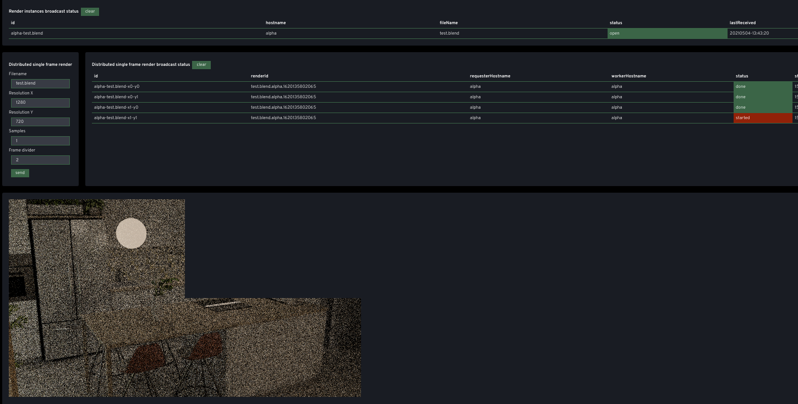
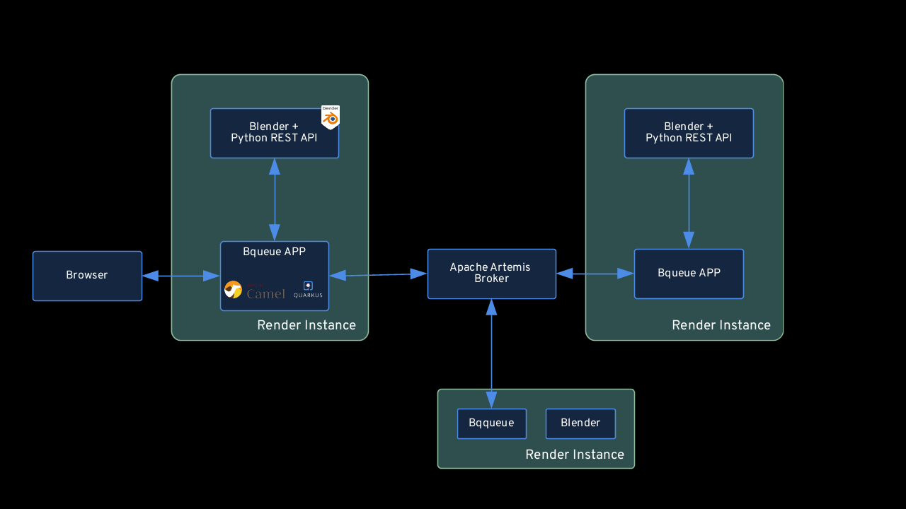

# Project bqueue


## Purpose of this project

/!\ This project is at a Proof of concept stage. It works but it's very rudimentary.

Aims at providing services to build and efficient blender 3D render farm.
Aims at being a cheap option that can be used to leverage old hardware to contribute to faster renders on personal render farms.




### Features currently include 

* Dividing frame into tiles and distribute rendering on different instances (bare metal, virtual, cloud..)
* Works on linux windows and mac 
* Merging tiles together as if it was rendered by a single machine
* Seing the progress of tiles being ready in a webinterface.
* Render components are completely distributed, there is no notion of coordinator/worker nodes, the only central piece is a messaging broker to broadcast,synchronize data betweeen instances.

### Roadmap features 

* Distribute frames of an animation to render


##  Quickstart Setup

Infra relies on a messaging system called Apache Artemis to load balance workloads according to their speed.

### Running with Docker images

#### Start an artemis broker

```
docker run -d --rm \
  -p 8161:8161 \
  -p 61616:61616 \
  -e ARTEMIS_USERNAME=admin \
  -e ARTEMIS_PASSWORD=admin \
  -e DISABLE_SECURITY=true \
  --name artemis \
  vromero/activemq-artemis
```

#### Run bqueue application

```
docker run --rm -p 8080:8080 -e QUARKUS_ARTEMIS_URL=tcp://172.17.0.1:61616 -e BLENDERQUEUE_HOSTNAME=alpha bqueue
```

Go to http://localhost:8080 and start rendering

## Architecture details



* The architecture of our render farm relies on the following principles
  * There is a central Apache Artemis Message Broker that supports streaming transfers of large files with good memory management. Instances will be able to broadcast notification events, .blend files and collect render results to each other.
  * A render instance is composed of
    * A blender process with the script rest-api.py. This starts blender with a local rest api to open files and start effective renders.
    * The Bqueue app is built with a distributed integration framework Apache Camel (running with Quarkus flavor)
      * This componenent is responsible for orchestrating broadcasting blend files and render commands through Artemis Broker to other similar instances.
      * When images are renderd they can be collected by the instance that has requested a render to the network
      * A user can upload, broadcast and view the render results in realtime through a web interface.
  * There is no difference between the render instances, they can all act as worker or as a requester to submit renders to the network. The instance that initiates the request will collect the render results back from all the worker instances.
  * We leverage a hungry consumer pattern. Meaning that when a render request is launched, the render is divided into jobs and queued up in a single queue. Whichever worker consumes faster will get more jobs. This allows us to work with hardware of different speeds and still keep all instances as busy as possible to take most advantage of available resources.

## Running the application in dev mode

### Start blender rest api

```
blender -b -P rest-api.py -- target/data/renders target/data/blendfiles
```

### Running bqueue app

You can run your application in dev mode that enables live coding using:
```
mvn clean package -DskipTests
mvn quarkus:dev
```

Accessing the app : http://localhost:8080

Accessing SwaggerUi : http://localhost:8080/swagger-ui/

Accessing openapi spec of camel rests : http://localhost:8080/camel-openapi

Health UI : http://localhost:8080/health-ui/

Accessing metrics : http://localhost:8080/metrics

Metrics in json with filters on app metrics : `curl -H"Accept: application/json" localhost:8080/metrics/application`


### Run local container with specific network and IP address

Optionally you can create a separate local docker network for this app

```
docker network create --driver=bridge --subnet=172.18.0.0/16 --gateway=172.18.0.1 primenet 
```

```
docker stop bqueue
docker rm bqueue
docker rmi bqueue

docker build -f src/main/docker/DockerfileBlender.jvm -t bqueue .

docker run -d --net primenet --ip 172.18.0.10 --name bqueue -e QUARKUS_ARTEMIS_URL=tcp://172.18.0.1:61616 -e BLENDERQUEUE_HOSTNAME=alpha bqueue

```
## Push on dockerhub

```
docker login
docker build -t bqueue -f src/main/docker/Dockerfile.jvm .
docker tag bqueue:latest alainpham/bqueue:latest
```